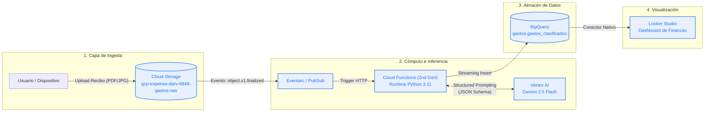

# Pipeline Automatizado de Extracción y Clasificación de Gastos con GCP

> **Proyecto Final - Fundamentos y Arquitectura en Google Cloud Platform**  
> **Repositorio:** [https://github.com/extdiegorenteria-ai/gcp-expense-classifier](https://github.com/extdiegorenteria-ai/gcp-expense-classifier)  
> **Entregable:** Arquitectura, Documentación Técnica y Código de Despliegue (IaC)

---

## 1. Identificación del Problema

El control de gastos personales y la conciliación contable para profesionales independientes y PYMEs suele ser un proceso manual, propenso a errores humanos y con baja periodicidad. La recolección física y digital de facturas, recibos y tickets de compra suele terminar en carpetas desorganizadas, retrasando el cálculo del flujo de caja y la toma de decisiones presupuestales.

### Objetivo
Automatizar de extremo a extremo el ciclo de vida del comprobante de gasto:
1. **Recepción:** Carga desatendida del archivo digital (imagen o PDF) en un almacenamiento en la nube.
2. **Procesamiento e Inteligencia:** Extracción automática de campos clave (comercio, fecha, categoría, moneda, subtotal, impuestos y total) mediante modelos multimodales de Inteligencia Artificial.
3. **Almacenamiento Analítico:** Inserción limpia y estructurada en un Data Warehouse columnar.
4. **Consumo y Visualización:** Exposición en un cuadro de mando analítico accesible en tiempo real.

---

## 2. Diagrama de Arquitectura

El flujo fue diseñado bajo un paradigma **100% Serverless** y orientado a eventos (*Event-Driven Architecture*), lo que garantiza costo cero en reposo y alta escalabilidad horizontal.



---

## 3. Servicios de Google Cloud Platform Utilizados

Cumpliendo con la consigna de emplear más de 3 servicios nativos de GCP, la arquitectura integra los siguientes componentes:

| Servicio | Rol Arquitectónico | Justificación Técnica |
| :--- | :--- | :--- |
| **Cloud Storage (GCS)** | *Landing Zone* (Almacenamiento crudo) | Almacenamiento de objetos de alta durabilidad (99.999999999%), bajo costo y soporte nativo para eventos de auditoría y ciclo de vida. |
| **Cloud Functions (2nd Gen)** | Cómputo Serverless y Orquestación | Ejecución basada en microcontenedores sobre Cloud Run. Permite escalar a cero cuando no hay actividad y procesar comprobantes en segundos ante cada evento. |
| **Vertex AI (Gemini 1.5 Flash)** | Motor de Inteligencia y Extracción | Modelo multimodal de baja latencia y alta precisión capaz de leer imágenes/documentos y garantizar una salida con tipado estricto mediante *Structured Outputs* (JSON Schema). |
| **BigQuery** | *Data Warehouse* Analítico | Motor de almacenamiento y análisis columnar optimizado para SQL. Permite particionado temporal y clustering por categoría para reportes analíticos de alta velocidad. |
| **Looker Studio** | Inteligencia de Negocio (*BI*) | Plataforma nativa gratuita de reporting que se conecta sin latencia a BigQuery para exponer métricas de gasto, presupuesto y variaciones mensuales. |
| **Cloud IAM** | Seguridad y Gobierno | Implementación del principio de menor privilegio (*Least Privilege*) mediante una Service Account dedicada con permisos acotados a BigQuery, Storage y Vertex AI. |

---

## 4. Descripción Paso a Paso de la Solución

1. **Ingesta del Documento:**
   El usuario o aplicación móvil deposita el archivo del comprobante (fotografía en `.jpeg`/`.png` o documento `.pdf`) en el bucket de Cloud Storage `gs://gcp-expense-darv-6849-gastos-raw/inbox/`.

2. **Detección y Disparo Reactivo:**
   Cloud Storage emite una notificación de evento `google.cloud.storage.object.v1.finalized` a través de **Eventarc**. Este evento despierta inmediatamente a la **Cloud Function (2nd Gen)** pasando los metadatos del archivo.

3. **Inferencia Multimodal con Vertex AI:**
   La función lee el archivo desde el bucket en memoria temporal y realiza una invocación a la API de **Vertex AI** utilizando el modelo `gemini-2.5-flash`. Se le provee un *System Instruction* y un esquema JSON estricto para extraer:
   - `fecha_emision` (YYYY-MM-DD)
   - `nombre_comercio` (Texto estandarizado)
   - `categoria` (`Alimentacion`, `Transporte`, `Servicios`, `Salud`, `Educacion`, `Ocio`, `Otros`)
   - `moneda` (ISO 4217, ej. PEN, USD, EUR)
   - `monto_total` (Float numérico)
   - `impuestos` (Monto desglosado si aplica)

4. **Persistencia Estructurada en BigQuery:**
   La Cloud Function valida que la respuesta cumpla con el contrato de datos y realiza una inserción directa (*streaming insert*) en la tabla `gastos.gastos_clasificados`. El registro incluye además el enlace de auditoría al archivo original en GCS y el timestamp de procesamiento.

5. **Consumo y Alertas en Looker Studio:**
   Looker Studio consulta la tabla de BigQuery y presenta tableros interactivos con:
   - Indicador de gasto total del mes en curso vs. mes anterior.
   - Gráfico de torta/barras con la distribución de gastos por categoría.
   - Tabla detallada de transacciones con búsqueda por comercio.

---

## 5. Modelo de Datos (Esquema en BigQuery)

Dataset: `gastos`  
Tabla: `gastos_clasificados` (Particionada por `fecha_gasto` diaria)

```sql
CREATE TABLE IF NOT EXISTS `gcp-expense-darv-6849.gastos.gastos_clasificados` (
  id_transaccion STRING OPTIONS(description="Identificador único UUID"),
  fecha_gasto DATE OPTIONS(description="Fecha de emisión del comprobante"),
  comercio STRING OPTIONS(description="Razón social o nombre comercial"),
  categoria STRING OPTIONS(description="Categoría estandarizada del gasto"),
  moneda STRING OPTIONS(description="Código ISO de moneda (PEN, USD, EUR)"),
  monto_total NUMERIC OPTIONS(description="Importe total facturado"),
  monto_impuesto NUMERIC OPTIONS(description="Monto de impuestos desglosado"),
  archivo_origen_gcs STRING OPTIONS(description="URI de almacenamiento del archivo"),
  confianza_extraccion FLOAT64 OPTIONS(description="Nivel de certidumbre del modelo"),
  fecha_procesamiento TIMESTAMP OPTIONS(description="Momento exacto del análisis")
)
PARTITION BY fecha_gasto
CLUSTER BY categoria, moneda;
```

---

## 6. Estructura del Repositorio

```text
.
├── README.md               # Documento central del proyecto y arquitectura
├── .gitignore              # Exclusiones de Git
├── terraform/              # Infraestructura como Código (IaC)
│   ├── main.tf             # Definición de recursos (GCS, BQ, Function, IAM)
│   ├── variables.tf        # Variables configurables (project_id, region)
│   ├── outputs.tf          # Salidas útiles post-despliegue
│   └── terraform.tfvars.example
├── src/                    # Código fuente de la Cloud Function
│   ├── main.py             # Lógica de parsing, llamada a Vertex y carga a BQ
│   └── requirements.txt    # Dependencias de Python
└── tests/                  # Datos de prueba y validación
    └── sample_receipt.json # Simulación de evento de entrada
```

---

## 7. Análisis de Costos y Free Tier

La solución fue concebida para operar dentro del **GCP Free Tier**:
- **Cloud Storage:** 5 GB/mes incluidos de forma gratuita en regiones US.
- **Cloud Functions:** 2 millones de invocaciones gratuitas mensuales.
- **BigQuery:** 10 GB de almacenamiento mensual y 1 TB de consultas sin costo.
- **Vertex AI (Gemini 1.5 Flash):** Facturación por consumo. Con un costo de aprox. $0.075 por millón de tokens de entrada, procesar 500 comprobantes mensuales equivale a menos de **$0.05 USD**, cubierto enteramente por los créditos de cortesía de GCP.
